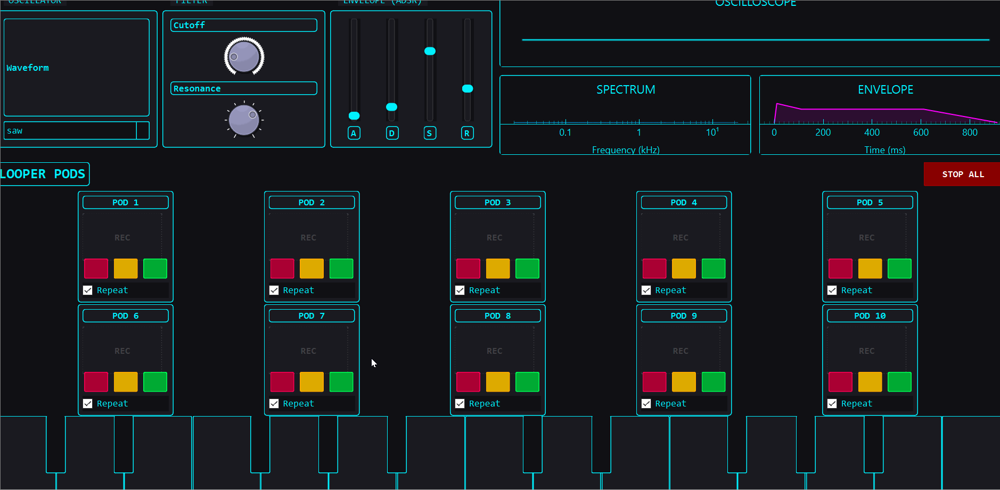

# Synth

A Python-based Digital Audio Workstation (DAW) Lite application with a Cyberpunk/Sci-Fi aesthetic.

> **Note:** This project is the first experience with full vibe coding using Google Antigravity and Gemini 3 Pro.




## Features

- **Virtual Keyboard**: Play synthesizer sounds with a piano-style layout.
- **Looper Pods**: Record and loop audio samples with individual controls.
- **Visualizers**: Real-time oscilloscope and spectrum analyzer.
- **Cyberpunk Aesthetic**: styled with Qt Style Sheets (QSS) for a dark, neon look.

## Installation

1.  **Clone the repository:**
    ```bash
    git clone <repository_url>
    cd Synth
    ```

2.  **Create and activate a virtual environment (recommended):**
    ```bash
    python -m venv .venv
    # Windows
    .venv\Scripts\activate
    # macOS/Linux
    source .venv/bin/activate
    ```

3.  **Install dependencies:**
    ```bash
    pip install -r requirements.txt
    ```

## Getting Started

To run the application, execute the `run.py` script from the root directory:

```bash
python run.py
```

## Requirements

- Python 3.x
- PySide6
- numpy
- scipy
- sounddevice
- pyqtgraph

## License

[MIT License](LICENSE)
